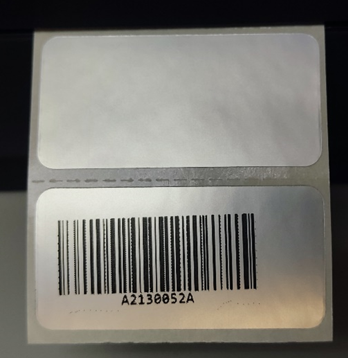
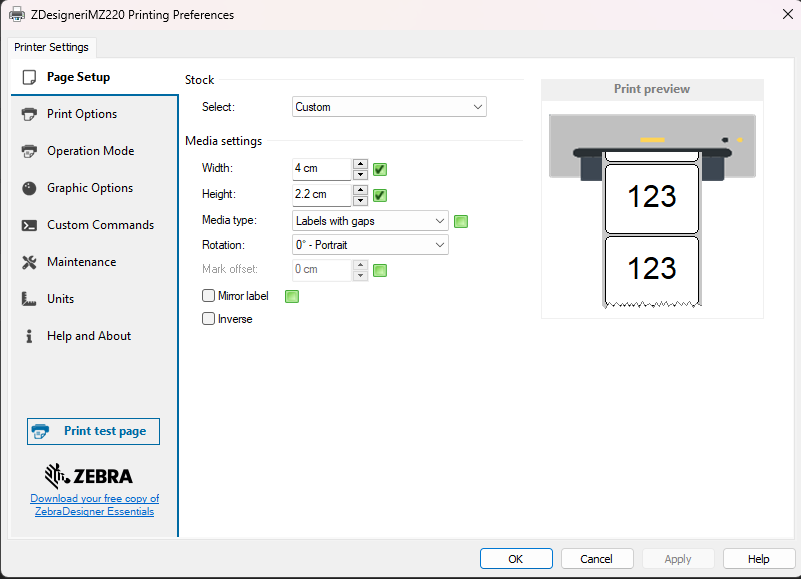
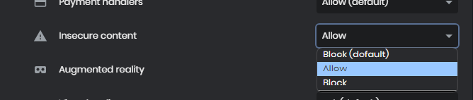

# BarCode-inator 3000

This project develop is focus on **Generate BarCodes in Web systems** with HTML and JS, with the capacity of use in remote servers, capable to send into a **Zebra Printer** connected into the **client's device**. This project is part of school sojourn.

>The test of this project was done with: [**Zebra ZD220 Transfer Desktop Printer**](https://www.zebra.com/us/en/support-downloads/printers/desktop/ZD200t.html) with USB conection inside a **Windows 11** operating system and a **Android** smartphone. 
>Future test with **Zebra ZT230** are expected.

## Previous Configuration

### Printers

It's necessary to add the printer into the client device log, to do that Zebra drivers will be needed.

> Use the **Wizards** reccomended by **Zebra Tecnologies** that are able to automatic detect the printer's info. Check out the [Oficial WebSite](https://www.zebra.com/us/en/support-downloads/printers.html) for your printer.

Once the Printer is installed, it's recommended to calibrate the label's sizes and dimensions into **Printing Preferences** in "Device and Printers" from windows.

>If there is any problem with the printer log, check out that the **Printer Spooler** is **Running** in **Windows Services**.

### Web Browser

To be able to use the BarCode Generator project into **Google** o **Chromium** based browsers, it's necessary to modify the "**Site Settings**", which should allow "**Insecure content**" (otherwise the project will not run in these browsers).

## Contributions

The JavaScript library is from [Johan Lindell](http://lindell.github.io/JsBarcode/), 2012. Modern versions are available.